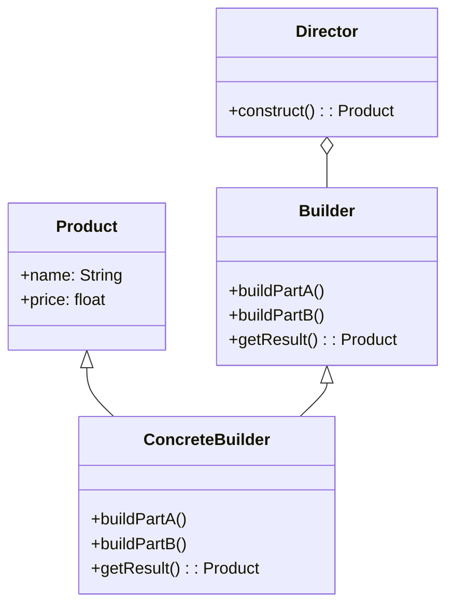

# ex-java-design_patterns-house_builder
Exercise to practice Builder design pattern.

# Instrucciones
Partiendo de la entidad "House" deberás implementar el patrón de diseño Builder para permitir que la entidad "House" pueda construir diferentes tipos de casas, según las características mostradas en el diagrama proporcionado. Cada tipo de casa debe representar una combinación específica de atributos (garage, jardín, piscina, estatuas decorativas, etc.).

El objetivo es que el proceso de construcción sea flexible, escalable y desacoplado, siguiendo los principios de diseño orientado a objetos.

# Requisitos
- Se debe aplicar correctamente el patrón Builder, permitiendo construir instancias de House con distintas configuraciones.
- La implementación de una "interface" es obligatoria (Strategy 2).
- Se debe alcanzar un mínimo del 70% de cobertura de pruebas unitarias
- El código debe estar correctamente estructurado, documentado y seguir buenas prácticas de desarrollo.

# Entregables
- Repositorio en GitHub con el código fuente completo.
- Diagrama de clases que represente la estructura del patrón Builder aplicado a la entidad House. (Integrar en el Readme).
- Captura de pantalla de la sección "Test coverage" que demuestre el cumplimiento del requisito mínimo del 70%. (Integrar en el Readme).

Perfecto, Giacomo. Aquí tienes los **criterios de evaluación** añadidos al ejercicio, para que los estudiantes tengan claro cómo se valorará su trabajo:

---

## Criterios de Evaluación

| Criterio                          | Descripción                                                                 | Puntos |
|----------------------------------|-----------------------------------------------------------------------------|--------|
| **Aplicación del patrón Builder** | Implementación correcta y coherente del patrón Builder en la entidad `House`. | 30     |
| **Modularidad y diseño limpio**   | Separación adecuada de responsabilidades, uso de clases bien estructuradas. | 20     |
| **Cobertura de pruebas ≥ 70%**    | Evidencia de pruebas unitarias con cobertura mínima del 70%.                | 20     |
| **Diagrama de clases**            | Claridad, precisión y correspondencia con la implementación.                | 15     |
| **Presentación y documentación**  | Claridad en README, comentarios útiles en el código, y entrega ordenada.    | 15     |

**Puntaje total: 100 puntos**

-----------

# Builder

## Tipo
- Patrón de diseño creacional

## Objetivo
- Construir objetos complejos paso a paso. El patrón nos permite producir distintos tipos y representaciones de un objeto empleando el mismo código de construcción. Útil cuando debes crear un objeto con muchas opciones posibles de configuración.

## Que resuelve
1. Un constructor con un montón de parámetros tiene su inconveniente: no todos los parámetros son necesarios todo el tiempo.

## Diagrama de clases 

## Ejemplos
- https://refactoring.guru/es/design-patterns/builder/java/example

## Source
- https://refactoring.guru/es/design-patterns/builder
