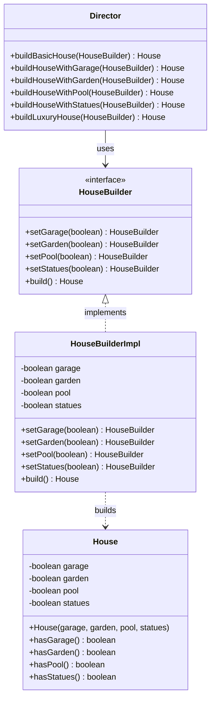
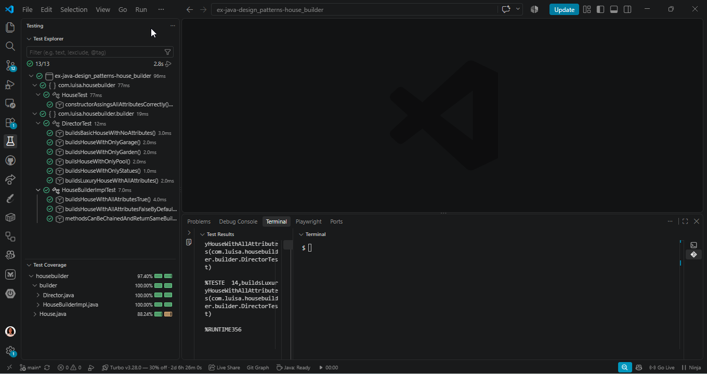
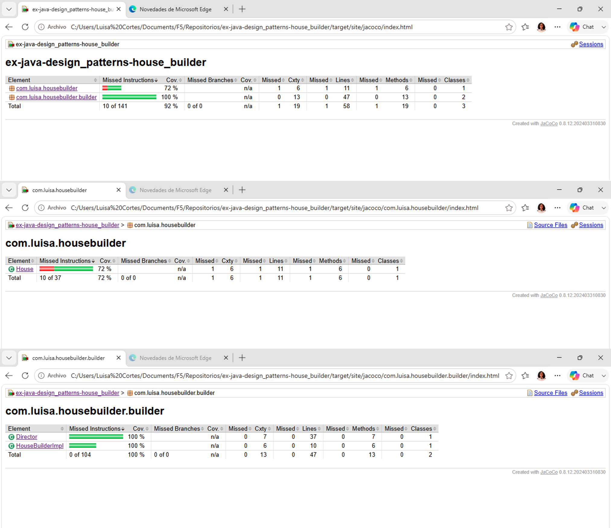

# ex-java-design_patterns-house_builder
Exercise to practice Builder design pattern.

# Instrucciones
Partiendo de la entidad "House" deberás implementar el patrón de diseño Builder para permitir que la entidad "House" pueda construir diferentes tipos de casas, según las # 🏠 House Builder — Patrón de diseño Builder

Proyecto del bootcamp de Factoría F5 en el que se aplica el **patrón de diseño Builder** para construir distintas configuraciones de un objeto `House`, usando una interfaz obligatoria (`HouseBuilder`) y una clase `Director` que orquesta la construcción.

🔗 Repositorio: [lcortes89/Design-Patterns-Builder](https://github.com/lcortes89/Design-Patterns-Builder)


## 📑 Índice

- [Descripción](#-descripción)
- [Funcionalidades](#-funcionalidades)
- [Diagrama de clases](#-diagrama-de-clases)
- [Tecnologías](#-tecnologías)
- [Pre-requisitos](#-pre-requisitos)
- [Instalación](#-instalación)
- [Uso](#-uso)
- [Tests y cobertura](#-tests-y-cobertura)
- [Estructura del proyecto](#-estructura-del-proyecto)
- [Autora](#-autora)

## 📝 Descripción

Este ejercicio consiste en modelar la construcción de una casa (`House`) sin exponer un constructor con muchos parámetros. En su lugar, se define una interfaz `HouseBuilder` (la "promesa" de cómo se construye una casa paso a paso) y una única implementación concreta, `HouseBuilderImpl`, que va configurando cada característica de la casa mediante métodos encadenables (*method chaining*).

Una clase `Director` conoce distintas "recetas" de construcción (casa básica, con garaje, con jardín, con piscina, con estatuas, o de lujo con todo) y las ejecuta reutilizando siempre el mismo `HouseBuilder`, sin depender de su implementación concreta.

[↑ Índice](#-índice) • [Siguiente →](#-funcionalidades)

## ⚙️ Funcionalidades

- Construcción de objetos `House` inmutables (atributos `final`, sin setters) a través de un builder mutable.
- Interfaz `HouseBuilder` que define el contrato de construcción (`setGarage`, `setGarden`, `setPool`, `setStatues`, `build`).
- Clase `Director` con 6 métodos de construcción predefinidos: casa básica, con garaje, con jardín, con piscina, con estatuas y casa de lujo.
- El `Director` trabaja contra la interfaz `HouseBuilder`, no contra la implementación concreta, demostrando el desacoplamiento propio del patrón.
- Suite de tests unitarios con JUnit 5 y cobertura medida con JaCoCo (≥ 70 % exigido, 97,40 % alcanzado).

[← Anterior](#-descripción) • [↑ Índice](#-índice) • [Siguiente →](#-diagrama-de-clases)

## 🧩 Diagrama de clases



[← Anterior](#-funcionalidades) • [↑ Índice](#-índice) • [Siguiente →](#-tecnologías)

## 🛠️ Tecnologías

- Java 21
- Maven
- JUnit 5
- JaCoCo (cobertura de tests)

[← Anterior](#-diagrama-de-clases) • [↑ Índice](#-índice) • [Siguiente →](#-pre-requisitos)

## 📋 Pre-requisitos

- JDK 21 instalado
- Maven instalado (o usar el wrapper `mvnw` si el proyecto lo incluye)
- Git

[← Anterior](#-tecnologías) • [↑ Índice](#-índice) • [Siguiente →](#-instalación)

## 💻 Instalación

```bash
git clone https://github.com/lcortes89/Design-Patterns-Builder.git
cd Design-Patterns-Builder
mvn install
```

[← Anterior](#-pre-requisitos) • [↑ Índice](#-índice) • [Siguiente →](#-uso)

## ▶️ Uso

Compilar y ejecutar los tests:

```bash
mvn test
```

Generar el paquete y el informe de cobertura:

```bash
mvn verify
```

[← Anterior](#-instalación) • [↑ Índice](#-índice) • [Siguiente →](#-tests-y-cobertura)

## ✅ Tests y cobertura

El proyecto cuenta con 13 tests unitarios (JUnit 5) que cubren `House`, `HouseBuilderImpl` y `Director`, incluyendo un test que demuestra que el `Director` funciona con cualquier implementación de `HouseBuilder`.

La cobertura de tests, medida con JaCoCo, es del **97,40 %**, muy por encima del 70 % mínimo exigido:

- `Director.java` → 100 %
- `HouseBuilderImpl.java` → 100 %
- `House.java` → 88,24 %

| Test Coverage | Test Jacoco |
|:---:|:---:|
| <a href="./src/test/test.png"></a> | <a href="./src/test/jacoco.png"></a> |

> 💡 Captura tomada desde el informe HTML de JaCoCo (`target/site/jacoco/index.html`) tras ejecutar `mvn verify`.

[← Anterior](#-uso) • [↑ Índice](#-índice) • [Siguiente →](#-estructura-del-proyecto)

## 📂 Estructura del proyecto

```
Design-Patterns-Builder/
├── docs/
│   └── coverage.png
├── src/
│   ├── main/java/com/luisa/housebuilder/
│   │   ├── House.java
│   │   └── builder/
│   │       ├── HouseBuilder.java
│   │       ├── HouseBuilderImpl.java
│   │       └── Director.java
│   └── test/java/com/luisa/housebuilder/
│       ├── HouseTest.java
│       └── builder/
│           ├── HouseBuilderImplTest.java
│           └── DirectorTest.java
├── pom.xml
└── README.md
```

[← Anterior](#-tests-y-cobertura) • [↑ Índice](#-índice) • [Siguiente →](#-autora)

## 👩‍💻 Autora

**Luisa Cortés**
Estudiante del bootcamp de desarrollo de Factoría F5

[← Anterior](#-estructura-del-proyecto) • [↑ Índice](#-índice)
## Ejemplos
- https://refactoring.guru/es/design-patterns/builder/java/example

## Source
- https://refactoring.guru/es/design-patterns/builder
